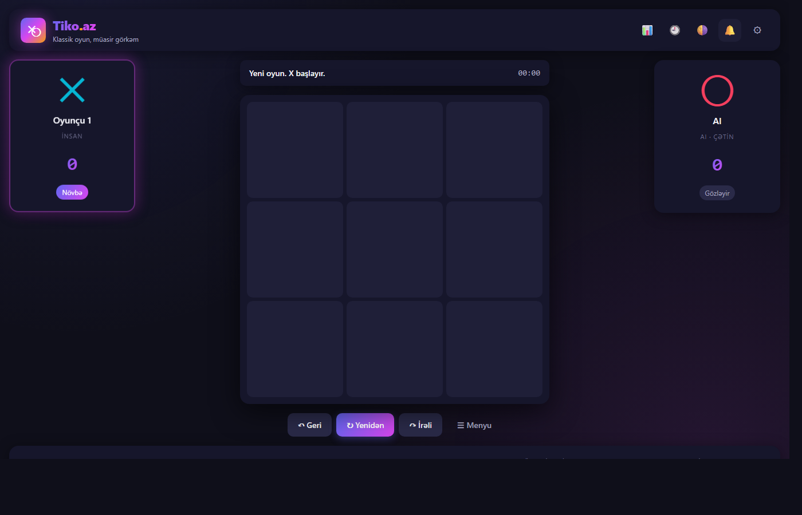
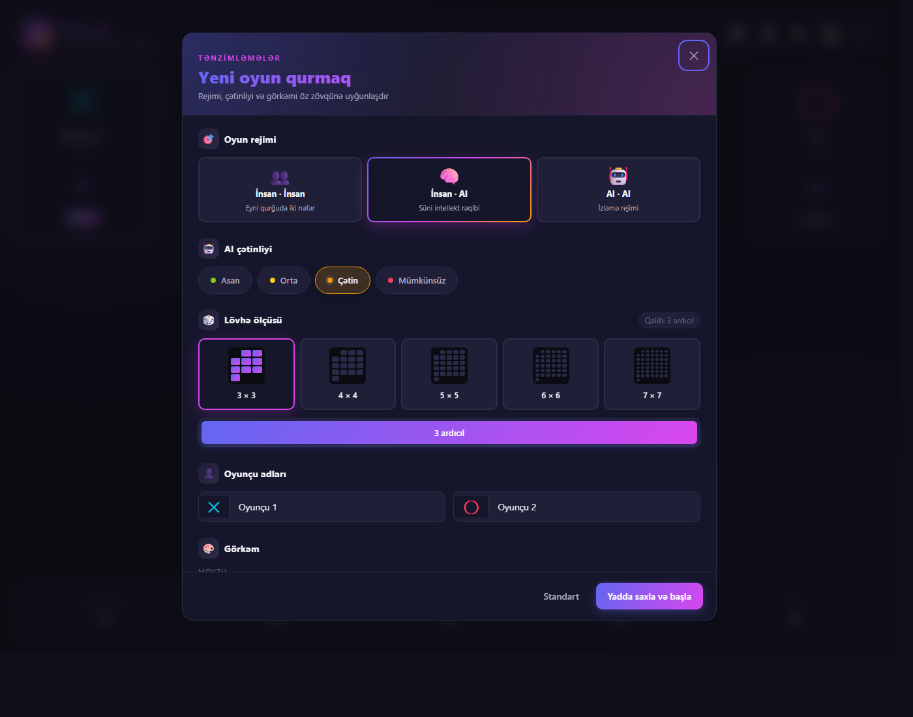
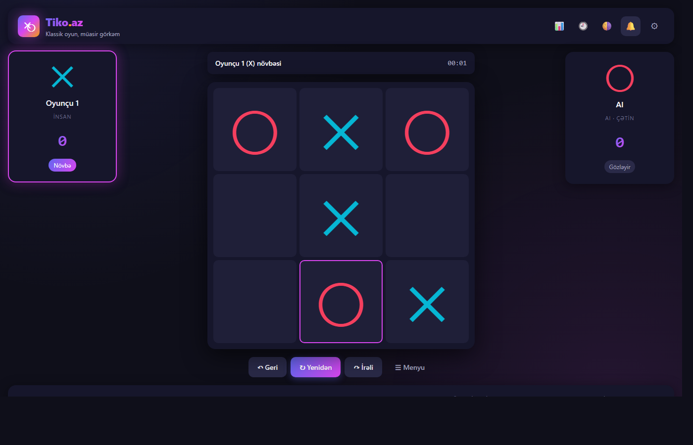
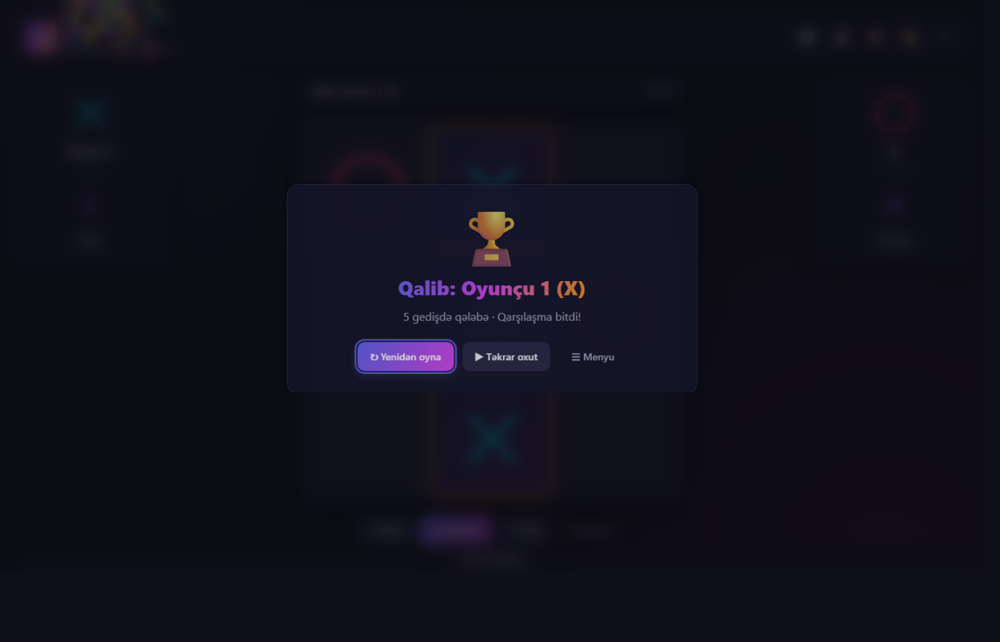
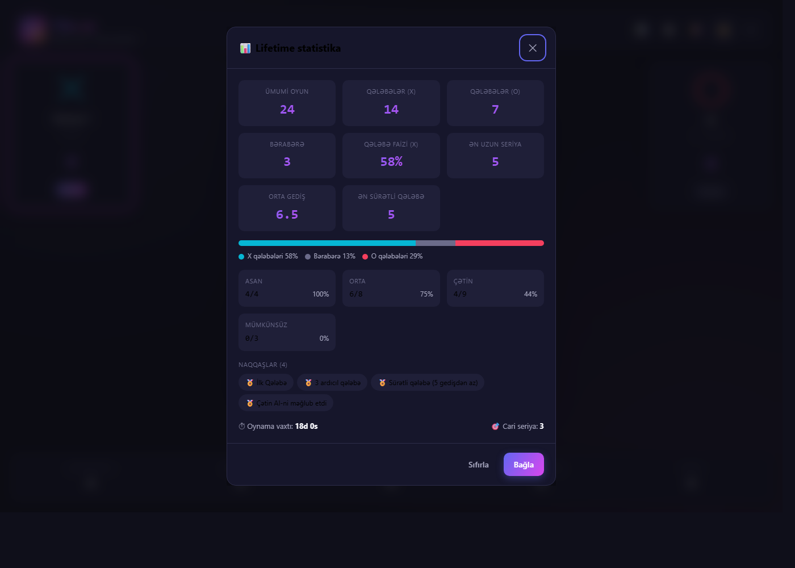
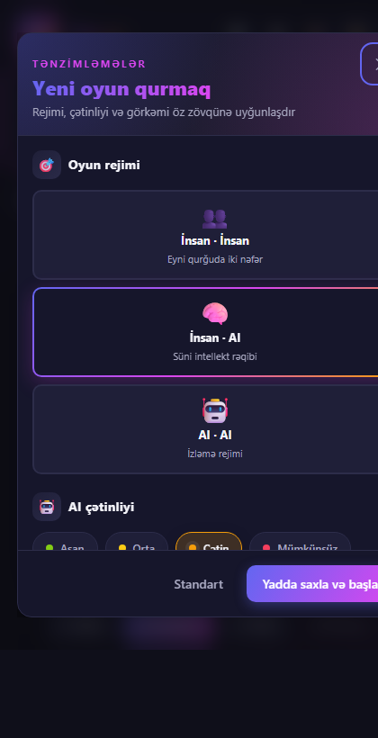

<div align="center">

# Tiko.az

### Klassik X-O oyunu, müasir görkəmli — peşəkar AI rəqibi ilə

[]()
[]()
[]()
[](LICENSE)
[]()
[](https://kofe.al/@goshgarhasanov)

**🎮 Canlı demo:** https://goshgarhasanov.github.io/tiko.az/

<br/>



</div>

---

## 📸 Ekran görüntüləri

<table>
<tr>
<td width="50%" align="center"><b>🎯 Yeni oyun menyusu</b><br/>Vizual kart seçicilər, rəng-kodlu chip-lər, mini grid preview-ləri<br/><br/></td>
<td width="50%" align="center"><b>🎮 Oyun gedişində</b><br/>Aktiv oyunçu vurğulanır, sonuncu gediş vurğulu<br/><br/></td>
</tr>
<tr>
<td width="50%" align="center"><b>🏆 Qələbə ekranı</b><br/>Qalib xətti vurğulanır, konfetti, təkrar oxutma<br/><br/></td>
<td width="50%" align="center"><b>📊 Lifetime statistika</b><br/>Çətinlik üzrə bölgü, naqqaşlar, qələbə faizi<br/><br/></td>
</tr>
<tr>
<td colspan="2" align="center"><b>📱 Mobil görkəm (420px)</b> — kart-lar stack olunur, hər şey rahat ölçülənir<br/><br/></td>
</tr>
</table>

---

## ✨ Niyə Tiko.az?

- 🇦🇿 **Tam Azərbaycan dilində** — tərcümə deyil, doğmadır.
- 🤖 **4 səviyyəli AI** — alpha-beta budamalı minimax ilə (mümkünsüz səviyyədə 3×3-də heç vaxt uduzmur).
- 📐 **Çevik lövhə** — 3×3, 4×4, 5×5, 6×6, 7×7 ölçülər; qalib şərti (3, 4, 5 ardıcıl) konfiqurasiya olunur.
- 🎨 **3 fərqli skin** — Klassik, Neon (retro arcade), Minimal — hər biri tünd və açıq mövzuda.
- 🎵 **Web Audio səslər** — heç bir audio fayl yox, hamısı kodda generasiya olunur.
- 📊 **Lifetime statistika** — qələbə faizi, ən uzun seriya, çətinlik üzrə paylanma, naqqaşlar.
- ↶ **Geri / İrəli** — istənilən gedişi geri alıb yenidən tətbiq edə bilərsiniz.
- 🎬 **Təkrar oxutma** — bütün oyunu addım-addım izləyin.
- 🏆 **Qarşılaşma rejimi** — 3, 5, 7 oyundan ən yaxşısı.
- ⌨ **Klaviatura qısayolları** — `R` (yeni), `Ctrl+Z` (geri), `Ctrl+Shift+Z` (irəli), `Esc` (modal bağla).
- 📱 **Tam responsiv** — masaüstündən mobil ekrana qədər.
- 🚫 **Build sistemi yox** — saf vanilla HTML/CSS/JS, sadəcə `python -m http.server` və ya GitHub Pages ilə açılır.

---

## 🚀 Necə işə salmaq

### 1) Birbaşa brauzerdə (canlı demo)

👉 [**Burada oyna**](https://goshgarhasanov.github.io/tiko.az/)

### 2) Lokal olaraq

ES modul-ları işlətmək üçün local HTTP server lazımdır (file:// işləməz):

```bash
git clone https://github.com/goshgarhasanov/tiko.az.git
cd tiko.az
python -m http.server 8000
# brauzerdə aç: http://localhost:8000/
```

Yaxud `npx serve`, `live-server` və ya hər hansı static server.

---

## 🎮 Necə oynamaq

1. Sağ-yuxarı küncdəki ⚙ düyməsindən **rejim** seç (İnsan vs İnsan / İnsan vs AI / AI vs AI).
2. **Çətinlik** səviyyəsini, **lövhə ölçüsünü** və **qalib şərtini** təyin et.
3. **"Yadda saxla və başla"** düyməsinə vur.
4. Boş xanaya kliklə — gediş edirsən. AI öz növbəsində avtomatik cavab verir.
5. Qələbə zamanı qalib xətti vurğulanır və konfetti çıxır 🎉.

### Klaviatura qısayolları

| Düymə | Hərəkət |
|---|---|
| `R` | Yeni oyun |
| `Ctrl+Z` | Sonuncu gedişi geri al |
| `Ctrl+Shift+Z` | İrəli (redo) |
| `Esc` | Açıq modal-ı bağla |
| `Tab` + `Enter` | Klaviatura ilə xana seçimi |

---

## 🤖 AI haqqında

Dörd səviyyə eyni minimax mühərrikini fərqli parametrlərlə işlədir:

| Səviyyə | Davranış |
|---|---|
| **Asan** | Təsadüfi gedişlər, lakin dərhal qələbə imkanı varsa götürür. |
| **Orta** | Qələbəni alır, rəqibin qələbəsini blok edir, mərkəzə üstünlük verir. |
| **Çətin** | Minimax dərinlik 4 + alpha-beta budama, 500ms vaxt limiti. |
| **Mümkünsüz** | Tam minimax (3×3-də sonsuz dərinlik). 3×3-də heç vaxt uduzmur. |

### Heuristik qiymətləndirmə

Böyük lövhələrdə (5×5+) tam ağacı saymaq mümkün olmadığı üçün lövhə **xətt-xətt qiymətləndirilir**:

- Bir xətdə **N ardıcıl** simvol → `10^N` bal
- Qarışıq xəttlər (hər iki rəng var) → 0 bal
- Tam qələbə xətti → 10⁶ bal

Bu, AI-yə hər iki tərəfin "qrup" qurma cəhdlərini balanslaşdırmağa imkan verir.

---

## 🧪 Testlər

Daxili test sistemi brauzerdə işləyir (heç bir node lazım deyil):

```bash
python -m http.server 8000
# brauzerdə: http://localhost:8000/tests/
```

20+ test əhatə edir:
- Lövhə yaradılması, immutability, qalib aşkarı (sətir/sütun/diaqonal)
- Bərabərə vəziyyəti, çoxölçülü lövhələr (3×3, 4×4, 5×5)
- Notasiya çevrilməsi (A1 ↔ indeks)
- Oyun axını, geri/irəli
- AI determinizmi: mümkünsüz səviyyə həmişə qələbə imkanını görür və bloklayır
- AI vs AI mümkünsüz səviyyədə həmişə bərabərə bitir
- Heuristik qiymətləndirmə müsbət/mənfi balansı

---

## 📁 Layihə strukturu

```
tiko.az/
├── index.html              ← UI markup
├── manifest.webmanifest    ← PWA manifesti
├── styles/
│   ├── reset.css           ← CSS reset
│   ├── tokens.css          ← Dizayn token-ləri (rəng, ölçü, mövzu)
│   ├── layout.css          ← Əsas grid düzümü
│   ├── components.css      ← Düymələr, lövhə, modal, kart
│   ├── animations.css      ← Keyframe animasiyaları
│   └── themes/
│       ├── classic.css
│       ├── neon.css
│       └── minimal.css
├── scripts/
│   ├── main.js             ← Tətbiq giriş nöqtəsi
│   ├── core/
│   │   ├── board.js        ← Lövhə, qalib aşkarı (immutable)
│   │   ├── game.js         ← Oyun axını
│   │   ├── history.js      ← Gediş tarixçəsi, geri/irəli
│   │   └── notation.js     ← A1, B2, C3 notasiyası
│   ├── ai/
│   │   ├── minimax.js      ← Alpha-beta minimax
│   │   ├── heuristic.js    ← Lövhə qiymətləndirməsi
│   │   └── difficulty.js   ← Asan/orta/çətin/mümkünsüz
│   ├── ui/
│   │   ├── board-view.js   ← DOM render
│   │   ├── sound.js        ← Web Audio səslər
│   │   ├── confetti.js     ← Canvas konfetti
│   │   ├── modal.js        ← <dialog> idarəsi
│   │   ├── toast.js
│   │   └── stats-view.js
│   ├── store/
│   │   ├── settings.js     ← localStorage tənzimləmələr
│   │   └── stats.js        ← Lifetime statistika + naqqaşlar
│   └── i18n/
│       └── az.js           ← Bütün AZ strinqlər
├── tests/
│   ├── index.html
│   └── tests.js            ← 20+ brauzer testi
├── assets/
│   └── icons/favicon.svg
└── README.md
```

---

## 🎨 Dizayn

| Element | Dəyər |
|---|---|
| Əsas qradient | `#6366F1` → `#D946EF` → `#F59E0B` |
| X simvolu | Cyan `#06B6D4` |
| O simvolu | Coral `#F43F5E` |
| Şrift | Inter / Segoe UI (sistem) + JetBrains Mono (notasiya) |
| Animasiya zamanı | 120ms (sürətli), 200ms (əsas), 360ms (yumşaq) |

---

## 🛠 Texniki xüsusiyyətlər

- **Saf vanilla** — heç bir framework, kitabxana, build alət, dependency yoxdur.
- **ES modulları** — `<script type="module">` ilə import/export.
- **CSS Grid + Flexbox** — modern düzüm.
- **`<dialog>` element** — native modal dəstəyi.
- **localStorage** — tənzimləmələr və statistika.
- **PWA-ready** — manifest var, offline service worker əlavə oluna bilər.
- **Accessibility** — ARIA labellər, klaviatura naviqasiyası, screen reader dəstəyi.

---

## 📜 Lisenziya

[MIT](LICENSE) © 2026 Goshgar Hasanzadeh
